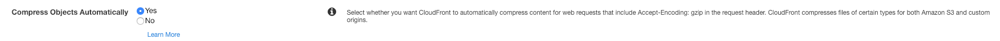

# Serving Static Content with AWS CloudFront

## TL;DR

[AWS CloudFront](https://aws.amazon.com/cloudfront/) is a content delivery network (CDN) solution that allows your content distribution to be shared in an accelerated manner from multiple edge locations around the world.

Benefits of using CDN:

1. Improving website load times
2. Reducing bandwidth costs
3. Increasing content availability and redundancy
4. Improving website security

## Example : CloudFront Setup for Image Serving

AWS Management Console
 -> CloudFront -> Distributions -> Create Distribution -> Get Started (Web)

### Create Distribution

#### Origin Settings (Rest of the section can be kept as default)

- [ ] `Origin Domain Name` : Path to images on S3 buckets (`<bucket_name>.s3.amazonaws.com`)
- [ ] `Origin Path` : Path to image folder (`/<path_to_image_folder>`)
- [ ] `Origin ID` : Keep default (Automatically populated upon the above value)
- [ ] `Origin Custom Headers` : HTTP/HTTPs request header, keep blank
- [ ] Click `Create Distribution`

After this process is complete, your status column will change from `In Progress` to `Deployed`.

- [ ] Get the CloudFront URL (<https://XXX.cloudfront.net>) from CloudFront Distribution Tab (`Domain Name`)

Note: this can take approx. 20 minutes to complete.

#### Enable Content Compression (Recommended)

At `Create Distribution` : Default Cache Behavior Settings -> Cache Based on Selected Request Headers (Choose `Whitelist`) -> Whitelist Headers (Choose `Accept-Encoding`) -> Compress Objects Automatically

At `Distribution Settings` : Behavior -> Edit -> Cache Based on Selected Request Headers (Choose `Whitelist`) -> Whitelist Headers (Choose `Accept-Encoding`) -> Compress Objects Automatically

- [ ] `Whitelist Headers`

Options:

- Forward all headers to your origin

**Important**: If you configure CloudFront to forward all headers to your origin, CloudFront doesn't cache the objects associated with this cache behavior. Instead, it sends every request to the origin.

- Forward a whitelist of headers that you specify. CloudFront caches your objects based on the values in all of the specified headers. CloudFront also forwards the headers that it forwards by default, but it caches your objects based only on the headers that you specify.

- Forward only the default headers. In this configuration, CloudFront doesn't cache your objects based on the values in the request headers.

- [ ] `Compress Objects Automatically`

## Reference

- [What is a CDN?](https://www.cloudflare.com/learning/cdn/what-is-a-cdn/)
- [Tutorial: Content Distribution with Amazon CloudFront](https://www.sumologic.com/blog/devops/content-distribution-amazon-cloudfront/)
- [Request Headers](https://docs.aws.amazon.com/AmazonCloudFront/latest/DeveloperGuide/RequestAndResponseBehaviorCustomOrigin.html)
- [Caching Content Based on Request Headers](https://docs.aws.amazon.com/AmazonCloudFront/latest/DeveloperGuide/header-caching.html)