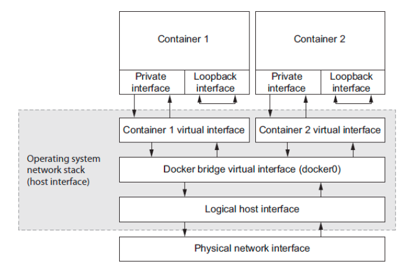

# Docker container networking

A container attached to a Docker network will get a unique IP address that is routable from other containers attached to the same Docker network.

Networks are treats  as first-class entities in Docker. They have their own life cycle and are *not* bound to any other objects.

By default Docker includes ***three*** networks where each is provided by a different driver:

```bash
docker network ls
NETWORK ID          NAME                DRIVER              SCOPE
04164f93085c        bridge              bridge              local
e5790991a29a        host                host                local
482cfd244aed        none                null                local
```

* The `bridge` driver provides inter-container connectivity for all containers running on the same machine.
* The `host` driver instructs Docker not to create any special networking namespace or resources for attached containers.
* Containers attached to the `none` network with `null` driver will not have any network connectivity outside of themselves.
* The `scope` of a network can take three values, `local`, `global`, or `swarm`.
* All of the default networks have the `local` scope, and will not be able to route traffic between containers running on different machines directly.



**NOTE** : Using the default bridge network is NOT recommended. It cannot take advantage of modern Docker features like *service discovery* or *IPVS based load balancing*.

## Bridge Network

Bridge networks are typically great for single server deployments like a LAMP stack running a content management system, or most local development tasks.

Underlay/Overlay network is suitable when running a multi-server environment that is designed to tolerate machine failure then you need to be able to seamlessly route traffic between containers on different machines.

* Underlay(i.e., macvlan or ipvlan network drivers in linux server) networks create first-class network addresses for each container. Those identities are discoverable and routable from the same network where the host is attached.
* Underlay network configuration is dependent on the host network and so definitions are rarely portable.
* Overlay network driver is available on Docker engines where *Swarm* mode is enabled.
* Overlay networks are similar in construction to bridge networks, but the logical bridge component is multi-host aware and can route inter-container connections between every node in a *Swarm*.
* Just like on a bridge network, containers on an overlay network are not directly routable from *outside* of the cluster. But, *inter-container* communication is simple and network definitions are mostly independent of the host network environment.

**TL;DR** :

* Create a bridge network

```bash
docker network create \
--driver bridge \
--label key1=value1 \
--label key2=value2 \
--attachable \
--scope local \
--subnet 10.0.42.0/24 \
--ip-range 10.0.42.128/25 \
user-network
```

* Attach network with `--network` or `docker network connect`

```bash
docker run --network network-name image-name
```

```bash
docker network connect \
network-name(or ID) \
target-container-name(or ID)
```