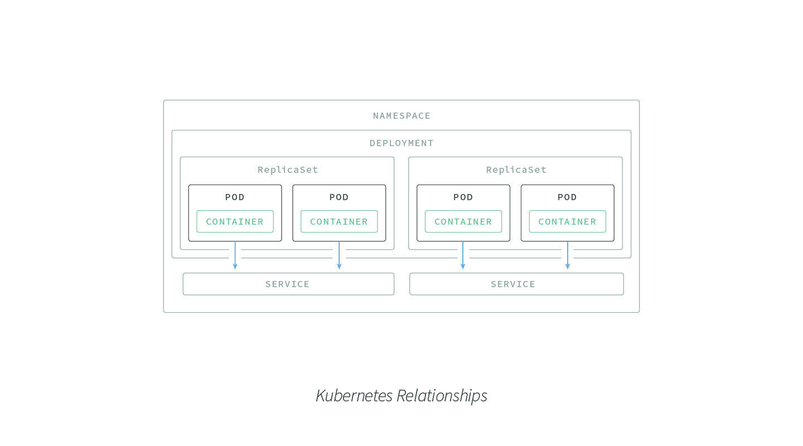
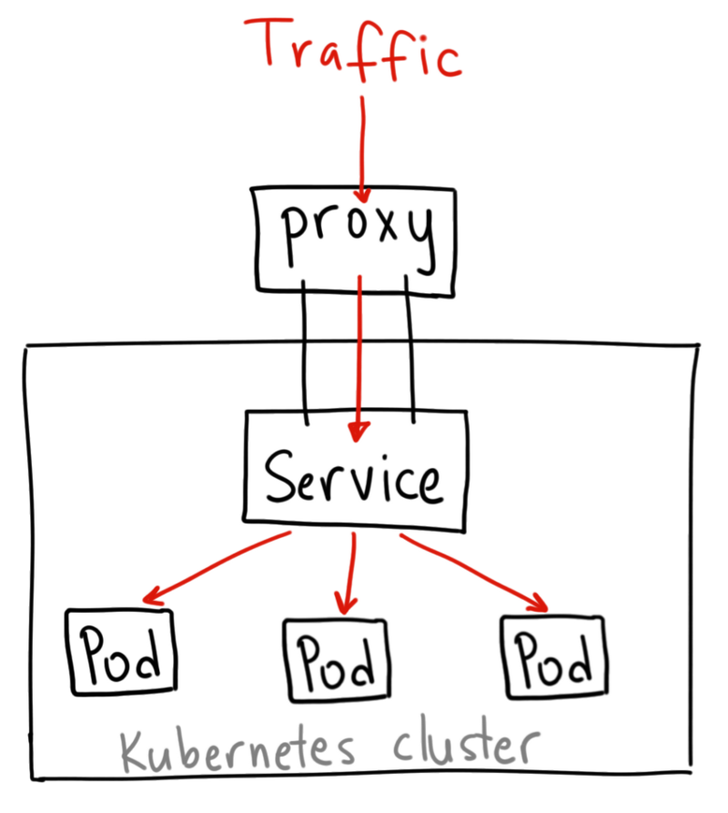

# Kubernetes

## Basics

Core components of the Kubernetes architecture:

**Pod**: The smallest deployable unit created and managed by Kubernetes, a Pod is a group of one or more containers. Containers within a Pod share an IP address and can access each other via localhost as well as enjoy shared access to volumes.

**Node**: A worker machine in Kubernetes. May be a VM or a physical machine, and comes with services necessary to run Pods.

**Service**: An abstraction which defines a logical set of Pods and a policy for accessing them. Assigns a fixed IP address to Pod replicas, allowing other Pods or Services to communicate with them.

**ReplicaSet**: Ensures that a specified number of Pod replicas are running at any given time. K8s recommend using Deployments instead of directly manipulating ReplicaSet objects, unless you require custom update orchestration or don’t require updates at all.

**Deployment**: A controller that provides declarative updates for Pods and ReplicaSets.

**Namespace**: Virtual cluster backed by the same physical cluster. A way to divide cluster resources between multiple users, and a mechanism to attach authorization and policy to a subsection of a given cluster.

Note: A Kubernetes cluster that handles production traffic should have a minimum of _three_ nodes.

## [Kubernetes Services](https://kubernetes.io/docs/tutorials/kubernetes-basics/expose/expose-intro/)

Although each Pod has a unique IP address, those IPs are not exposed outside the cluster without a _Service_. Services allow your applications to receive traffic. Services can be exposed in different ways by specifying a `type` in the **ServiceSpec**:

**ClusterIP (default)** - Exposes the Service on an **internal** IP in the cluster. This type makes the Service only reachable from within the cluster.

node

- ClusterIP service can be accessed from internet via `kubectl proxy`.
- Do NOT use this to expose your service to the internet or use it for production services.
- Can be used for debugging, displaying internal dashboards, etc.

NodePort - Exposes the Service on the same port of each selected Node in the cluster using NAT. Makes a Service accessible from outside the cluster using `<NodeIP>:<NodePort>`. Superset of ClusterIP.

- Some downsides to this method:

  1. You can only have once service per port.
  2. You can only use ports 30000–32767.
  3. If your Node/VM IP address change, you need to deal with that.

- Ideal for demo app or something temporary.

LoadBalancer - Creates an external load balancer in the current cloud (if supported) and assigns a fixed, external IP to the Service. Superset of NodePort.

- The standard way to expose a service to the internet

ExternalName - Exposes the Service using an arbitrary name (specified by `externalName` in the spec) by returning a CNAME record with the name. No proxy is used. This type requires v1.7 or higher of `kube-dns`.

- [ ] More information about the different types of Services can be found in the [Using Source IP](https://kubernetes.io/docs/tutorials/services/source-ip/) tutorial. Also see [Connecting Applications with Services](https://kubernetes.io/docs/concepts/services-networking/connect-applications-service/).

## Checklist

- [X] Install kubectl
- [X] Enabling shell autocompletion
- [X] Install Minikube (Local-machine solution)
- [ ] Prepare application images (`Dockerfile`, `docker-compose.yml`)
- [ ] Create [deployments](https://kubernetes.io/docs/concepts/workloads/controllers/deployment/#creating-a-deployment) from Kubernetes configuration files (as in `yml`)
- [ ] Rolling updates

Note: [`kompose`](https://kubernetes.io/docs/tasks/configure-pod-container/translate-compose-kubernetes/) can be used to translate a Docker Compose File to Kubernetes Resources/Files

## Cheatsheet

1. Check kubectl configuration: `kubectl cluster-info`
2. List deployments: `kubectl get deployments`
3. Scaling: `kubectl scale deployments/<deployment_name> --replicas=4`

## Useful Links

1. [Install and Set Up kubectl](https://kubernetes.io/docs/tasks/tools/install-kubectl/)
1. [Orchestrating Node.js Containers with Kubernetes](https://nodesource.com/blog/orchestrating-nodejs-containers-with-kubernetes/)
1. [Configuration Best Practices](https://kubernetes.io/docs/concepts/configuration/)
1. [Kubernetes ConfigMaps and Secrets](https://medium.com/google-cloud/kubernetes-configmaps-and-secrets-68d061f7ab5b)